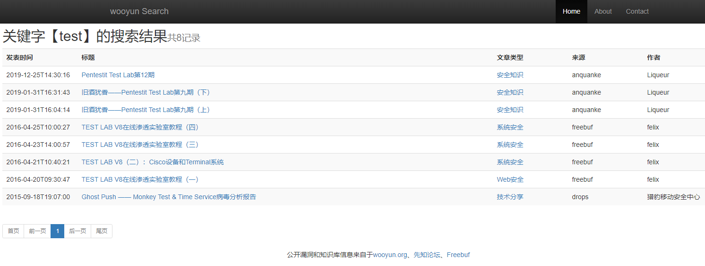
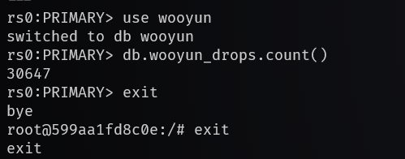
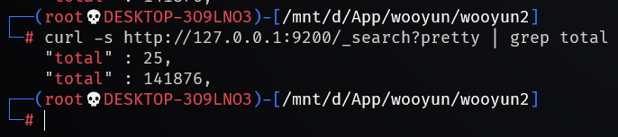

# wooyuxin
**乌云公开漏洞、各大安全网站知识库离线搜索**


1.简介
--------

源自[wooyun_public](https://github.com/hanc00l/wooyun_public)的`4W`公开漏洞和知识库进行拓展，采用`python2+mongodb+flask`和`Elasticsearch`搜索引擎。


搜索结果：




2.安装说明
--------

修改配置文件`docker-compose.yml`

web默认监听端口37527，`mongodb`默认转发到`127.0.0.1:37017`，`elasticsearch`默认转发到`127.0.0.1:39200`，如有需要可进行修改。

可以将`mongodb`和`elasticsearch`数据和日志映射到本地，参见配置文件中注释部分。

> 注意：`WSL`中无法将本地文件夹映射到容器中，如果在`windows`上使用请在`cmd`下执行。

启动容器

```
docker-compose up -d
```


3.数据导入导出
--------

下载离线数据后，将其中的`json`文件放到`json`目录下，文件夹放到`static`目录下。

登录`mongodb`容器后将`json`导入数据库中。

> 注意`wooyun_list_wooyun.json`为`wooyun`漏洞数据，需要导入到`wooyun_list`中，其他数据导入到`wooyun_drops`中。

```bash
docker exec -it wooyun2-mongodb /bin/bash
mongoimport -h 127.0.0.1 --port 27017 -d wooyun -c wooyun_list --file wooyun_list_wooyun.json
mongoimport -h 127.0.0.1 --port 27017 -d wooyun -c wooyun_drops --file=wooyun_drops_wooyun.json
```

查看数据导入情况：

`mongodb`可以直接在web主页看到当前数据库中存储的数量。也可以登录容器查看

```bash
docker exec -it wooyun2-mongodb /bin/bash
mongo
user wooyun
db.wooyun_drops.count()
db.wooyun_list.count()
```



数据导入到`mongodb`后会自动同步到`elasticsearch`，可以直接通过`API`接口进行查看。

```bash
curl -s http://127.0.0.1:39200/_search?pretty | grep total
```




> **同步时间大概需要半个小时以上，如比赛需要使用请提前搭好环境并同步好数据。**


导出数据：

```bash
# 导出全部数据
mongoexport --db=wooyun --collection=wooyun_drops --out=wooyun_drops.json mongodb://127.0.0.1:27017
mongoexport --db=wooyun --collection=wooyun_list --out=wooyun_list.json mongodb://127.0.0.1:27017

# 指定条件
mongoexport --db=wooyun --collection=wooyun_drops -q '{"producer": {"$eq": "weixin"}}' --out=wooyun_drops_test.json mongodb://127.0.0.1:27017
```


4.其它
--------

+ 本程序只用于技术研究和个人使用，程序组件均为开源程序，漏洞和知识库来源于互联网公开漏洞，版权归`wooyun.org`及其他各大网站所有。


5.Todo
--------

* 将web的`python2`改为`python3`，去除虚拟运行环境。
* 优化`elasticsearch`初始化部分

